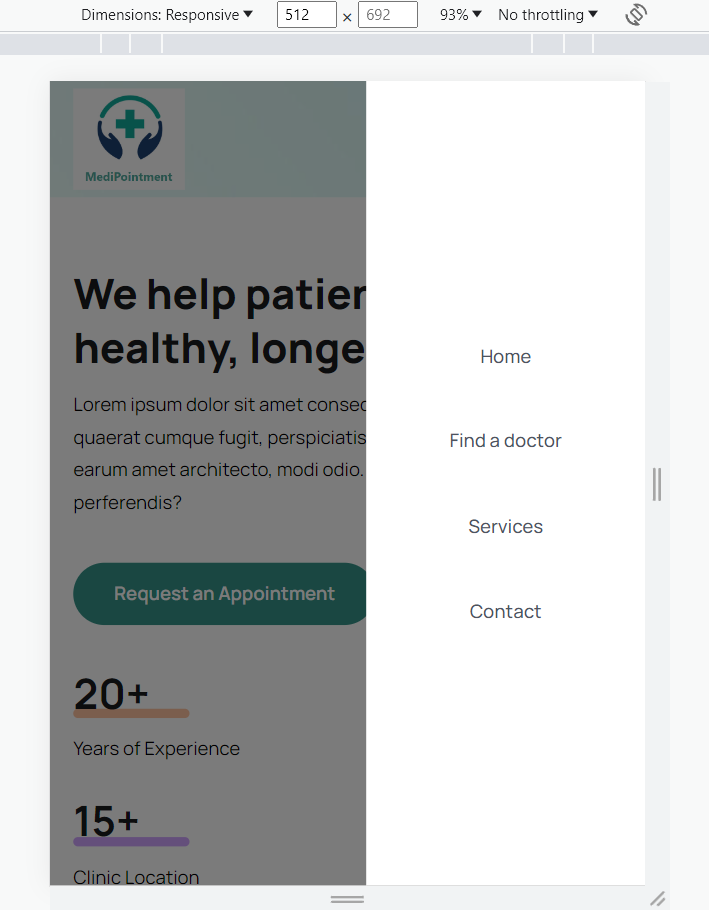
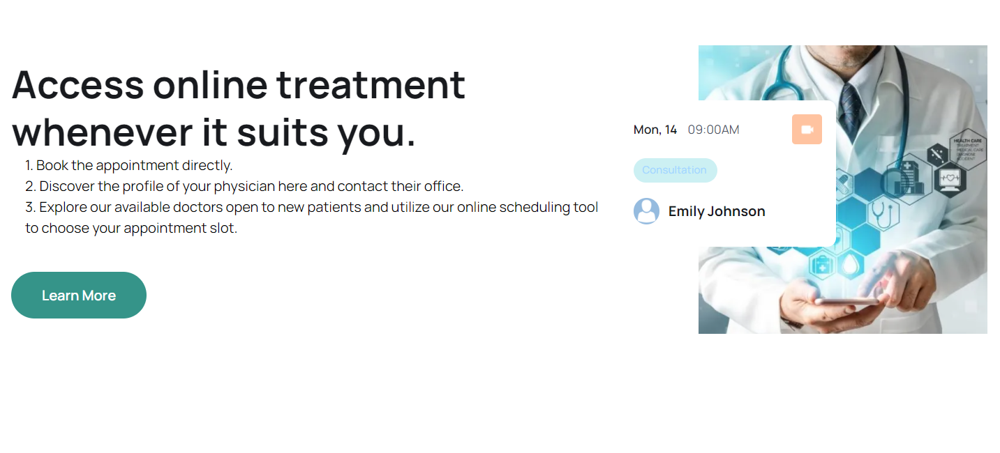
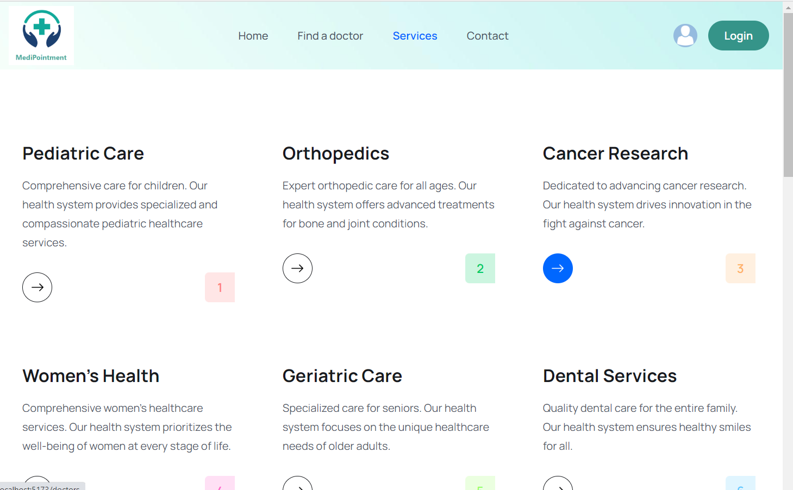
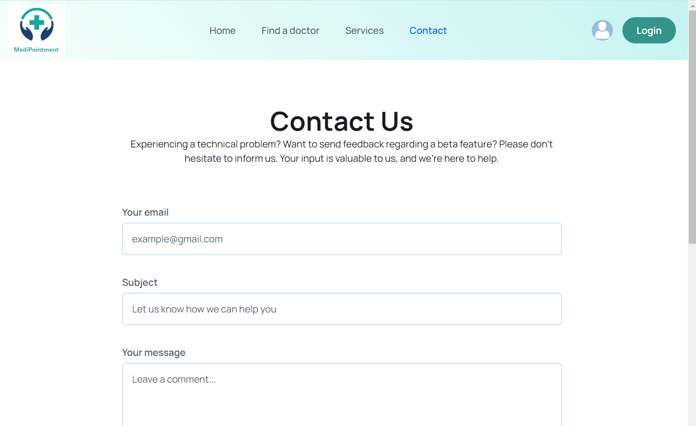

# Medical Appointment Booking Website (MERN Stack)

Welcome to the Medical Appointment Booking Website repository! This web application is built using the MERN (MongoDB, Express.js, React.js, Node.js) stack, and it allows users to book medical appointments with ease. The project also integrates JWT authentication for user security and a Stripe payment gateway for processing payments.

## Table of Contents

- [Features](#features)
- [Demo](#demo)
- [Installation](#installation)
- [Usage](#usage)
- [Technologies](#technologies)
- [Contributing](#contributing)
- [License](#license)

## Features

- **User Authentication:** Secure user registration and login using JWT (JSON Web Tokens).
- **Appointment Booking:** Users can easily search for available medical services and book appointments.
- **Payment Integration:** Integrated Stripe payment gateway for seamless and secure payment processing.
- **User Dashboard:** A user-friendly dashboard for managing appointments and personal information.
- **Responsive Design:** Modern and mobile-responsive user interface for a seamless experience on all devices.

## Demo









## Installation

Follow these steps to set up the project locally:

1. Clone the repository:

   ```bash
   git clone git@github.com:bettitaksas/medi-pointment.git

2. Navigate to the project directory
3. Install server and cliend dependencies after navigating backand or frontend folder:

   ```bash
   npm install

4. Create a .env file in the server directory and configure your environment variables. You will need to set up MongoDB and Stripe credentials: 

   ```bash
    PORT=5000
    MONGODB_URI=your_mongodb_uri
    JWT_SECRET=your_jwt_secret
    STRIPE_SECRET_KEY=your_stripe_secret_key

5. Start the server from the backend folder and the client from the frontend folder:

   ```bash
   npm run dev